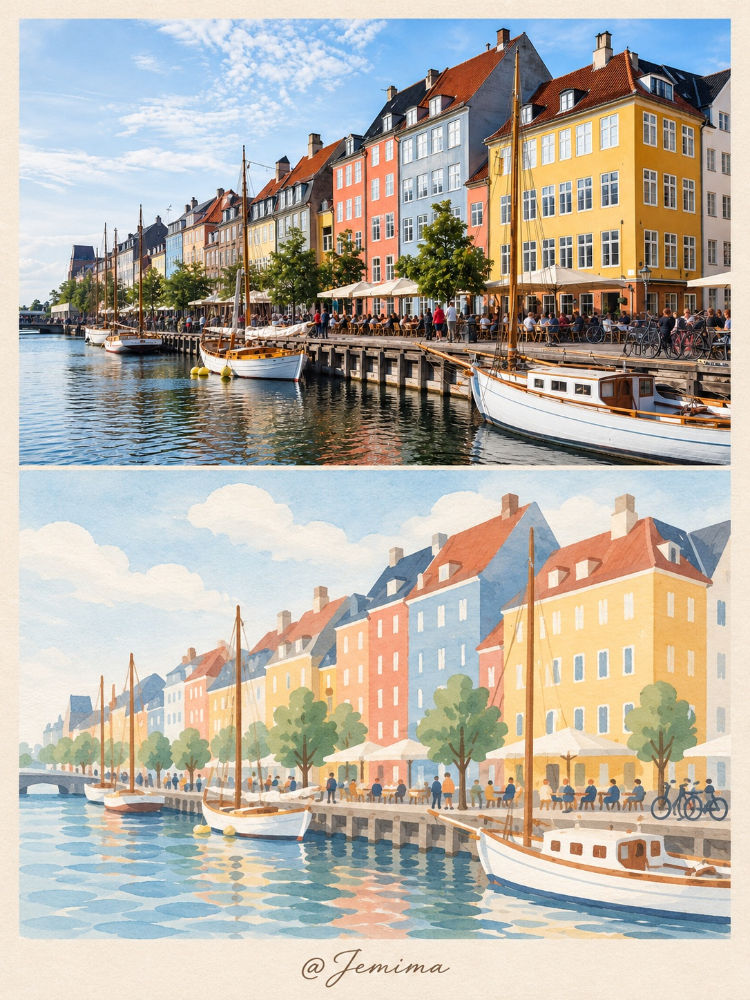
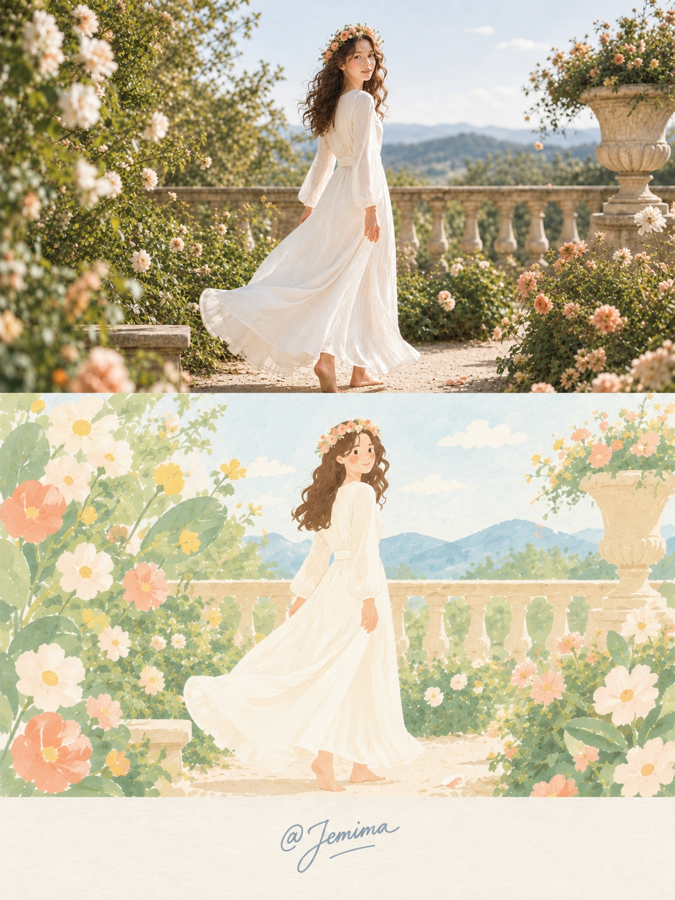
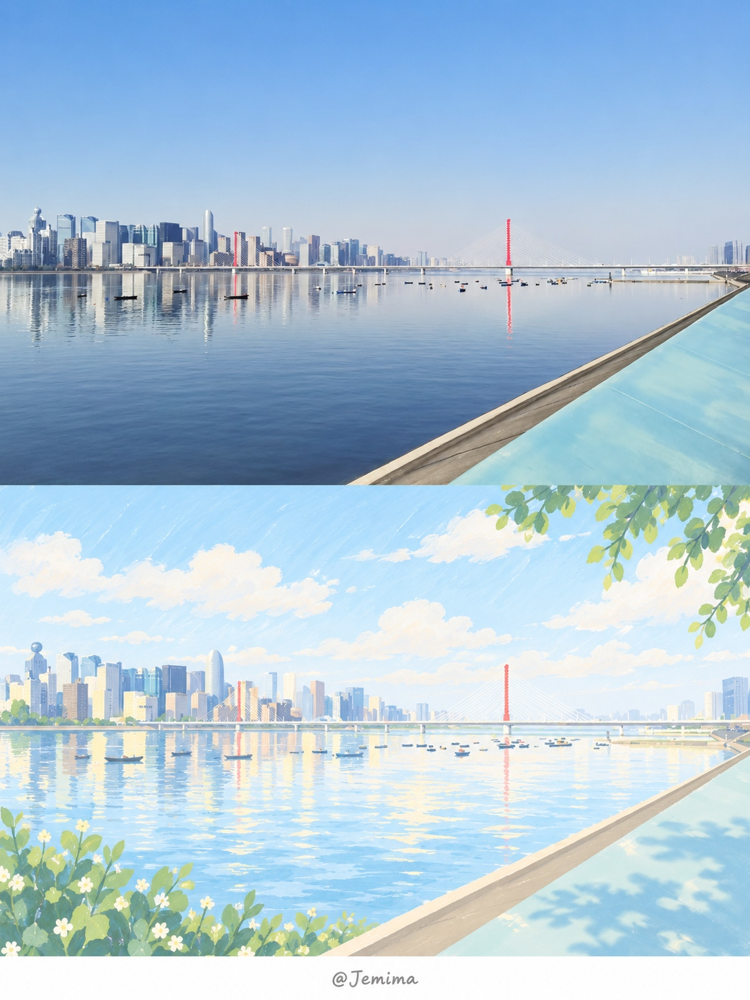
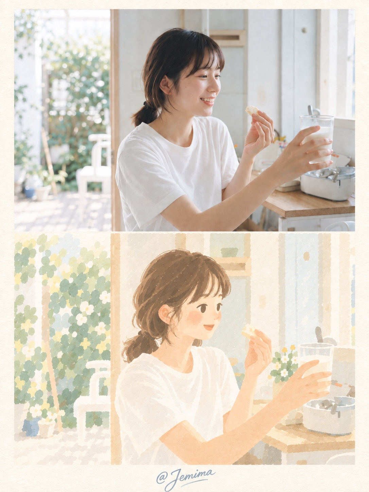

# 照片转治愈水彩插画｜Photo to Healing Watercolor V3.6

<p align="center">
  <strong>中文</strong> · <a href="./README_EN.md">English</a>
</p>

<p align="center">
  <strong>一键把照片重新设计成“原照片 + 超简化绘本插画”的 3:4 拼接卡片</strong>
</p>

---

## 简介

**照片转治愈水彩插画（Photo to Healing Watercolor）V3.6** 是一个面向照片治愈系水彩插画化的 One-Click Skill。

它的目标不是给照片套一层“水彩滤镜”，而是先理解照片中的主体、动作、关系和场景，再主动删除摄影细节、压缩重复元素、重构轮廓与色彩，最终把真实照片翻译成一套稳定、统一的绘本视觉语言。

默认最终输出为：

> **原照片 + 对应简化插画 + 3:4 极简北欧风明信片卡片**

正式英文名：

> **Photo to Healing Watercolor**

中文名：

> **照片转治愈水彩插画**

核心视觉关键词：

> **白 · 轻 · 淡 · 软 · 圆**

---

## 效果展示

<table>
<tr>
<td width="50%" valign="top">

</td>
<td width="50%" valign="top">

</td>
</tr>
<tr>
<td width="50%" valign="top">

</td>
<td width="50%" valign="top">

</td>
</tr>
</table>

---

## 核心能力

### 1. 一键执行

用户只需要上传一张照片并调用 Skill：

- 不需要选择复杂参数；
- 不需要手动设置简化等级；
- 不需要重新描述构图；
- 不需要额外编写生图提示词。

Skill 会自动识别场景，并根据人物、建筑、植物、水面、室内等不同对象选择对应的简化策略。

### 2. 不是“照片水彩化”，而是重新设计

核心流程：

`PHOTO → COMMON CROP → SEMANTIC LOCK → EXPRESSION LOCK → SHAPE MAP → DELETE → MERGE → COUNT COMPRESS → GRAPHIC ABSTRACTION → VISUAL DICTIONARY → SYMBOLIZE → ROUND REDESIGN → FLATTEN → WHITENED COLOR REDESIGN → ILLUSTRATE → QC → CARD COMPOSITE`

重点不是“把细节画柔”，而是：

- 删除无价值摄影信息；
- 合并重复对象；
- 压缩对象数量；
- 降低结构层级；
- 使用统一视觉符号；
- 重新设计整体轮廓；
- 压平真实光影与材质；
- 用奶油粉彩重新组织颜色。

### 3. 固定的绘本视觉语言

V3.6 以“超轻水粉绘本 + 柔和编辑插画 + 水彩纸质感”为核心。

视觉要求：

- 大面积纸白；
- 高明度、低到中低饱和；
- 圆润、柔软、略微不规则的轮廓；
- 大形状、少细节；
- 水粉与纸纹只提供轻微表面质感；
- 不依赖真实阴影、材质和空间透视。

---

## 人物标准

人物必须从“真人肖像”主动转为“绘本角色”。

### 五官

主角脸默认只保留约 **4–7 个视觉标记**：

- 小型深棕椭圆 / 短杏仁形眼睛；
- 极少眉毛；
- 鼻子默认省略；
- 短小珊瑚 / 暖棕嘴线；
- 两块柔和桃粉腮红。

禁止：

- 写实眼球；
- 睫毛细节；
- 鼻梁与鼻翼；
- 写实嘴唇；
- 牙齿细节；
- 真实面部骨相；
- 复杂面部阴影。

### 头发

头发从“发丝集合”压缩为：

- 1 个主发块；
- 2–5 个辅助发块；
- 卷发主要通过外轮廓波浪表达；
- 不绘制单根发丝和摄影高光。

### 服装

白色或浅色服装优先接近“纸白形状”：

- 大面积暖白 / 奶油白；
- 仅保留少量大褶线；
- 不表现真实布纹；
- 不使用复杂明暗塑造体积。

---

## 植物与花卉标准

### 花朵

花不是植物写生，而是页面装饰图形。

默认：

- 删除约 70–85% 的真实单朵花；
- 每个主要花区保留 3–6 个大型主花；
- 主花可比真实比例放大 3–7 倍；
- 花瓣宽、圆、钝；
- 允许不对称、粘连、缺瓣；
- 花心只保留一个简单点或小色块。

### 叶片

一组植物通常只使用 **2–3 种叶形模板**：

- 大型扁椭圆；
- 柔软长椭圆；
- 圆润卵形。

多片真实叶子合并为大型叶团，不画叶脉网络、枝杈写生或密集小叶。

---

## 建筑、水面与场景

### 建筑

建筑优先表达成“绘本中的房子形状”：

- 立面 = 大色块；
- 屋顶 = 简化色块；
- 窗户 = 短白竖线 / 小圆角矩形；
- 非关键连续建筑可减少约 30–50%；
- 相邻建筑之间尽量保留浅色呼吸缝隙；
- 尖锐屋顶主动变钝、变圆。

### 水面

水面首先是一块安静的色彩区域：

- 2–5 条宽大的蓝绿色水平色带；
- 少量暖白波纹；
- 少量米杏、淡珊瑚或奶油黄色反射块；
- 不画真实高频水纹；
- 不复制完整镜面倒影。

### 天空

天空优先承担留白功能：

- 暖白 / 奶油白纸面为主体；
- 1–3 个淡蓝云团；
- 避免写实云层、强烈阳光和 HDR。

---

## 色彩系统

V3.6 使用高白量奶油粉彩色系：

- 暖白 / 奶油白；
- 米杏 / 浅燕麦；
- 淡奶油黄；
- 淡桃粉；
- 淡珊瑚橙；
- 鼠尾草绿；
- 奶油黄绿；
- 淡青绿；
- 雾霾蓝 / 浅灰蓝；
- 柔和栗棕 / 奶咖棕。

原则：

> **颜色太实 → 增加白量，而不是增加灰量。**

---

## 3:4 卡片规范

最终卡片固定为 **竖版 3:4**。

推荐尺寸：

- `1536 × 2048 px`
- 或任意严格等比例的 3:4 尺寸。

卡片结构固定：

1. 上方：用户上传的原照片；
2. 下方：对应简化插画；
3. 最下方：米色纸面留白；
4. 留白区域中央：手写 `@Jemima`。

关键要求：

- 上方照片必须直接使用真实原图像素；
- 允许先做一次主体安全裁剪；
- 该裁剪即 `COMMON PANEL CROP`；
- 下方插画必须继承完全相同的裁剪范围；
- 上下两图显示宽度、高度、比例完全一致；
- 两张图之间 0 间距无缝拼接；
- 不允许拉伸图片；
- 不允许 AI 重绘上方原照片。

---

## 适用场景

Skill 会自动识别并适配：

- 人物写真；
- 婚纱 / 花园；
- 港口 / 海边；
- 城市街景；
- 江南 / 湖边 / 水乡；
- 自然风景；
- 室内生活；
- 建筑摄影；
- 日常静物。

---

## 使用方式

最简单的方式：

1. 提供 `photo-to-healing-watercolor_V3.6_SKILL.md`；
2. 上传需要处理的照片；
3. 指令模型调用该 Skill；
4. 默认直接输出 3:4 拼接卡片。

示例指令：

```text
调用 Photo to Healing Watercolor V3.6，
按照 Skill 默认标准处理这张照片。
```

如果只需要插画：

```text
调用 Photo to Healing Watercolor V3.6，只输出下方简化插画，不生成卡片。
```

---

## 设计原则

V3.6 最重要的判断标准不是“画得漂亮”，而是：

> **一眼能认出原照片拍了什么，同时一眼能看出它已经不是照片。**

正确结果应更接近：

> **根据照片重新设计出来的绘本页面。**

而不是：

> **照片被画成水彩。**

---

## 文件结构

```text
photo-to-healing-watercolor-v3.6/
├── README.md
├── README_EN.md
├── README_PREVIEW.html
├── photo-to-healing-watercolor_V3.6_SKILL.md
└── assets/
    ├── showcase-harbor.png
    ├── showcase-garden-portrait.png
    ├── showcase-river-skyline.png
    └── showcase-indoor-portrait.png
```

---

<p align="center">
  <a href="./README_EN.md">Switch to English README →</a>
</p>
